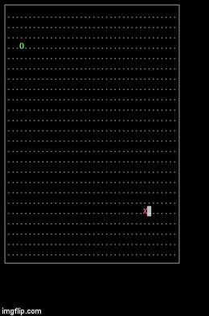

# Filler

5th C project for 42 Paris school.

<b>Summary:</b> We had to create our own programme-player to confront the ones of other student on the school made programme Filler. The principle is as follow: 2 players oppose each other on a board game and must place, one at a time, the piece given by the master of the game (enacted by a Ruby executable). They gain points doing so. The game end when no more pieces can be placed.

## What is Filler ?

Filler is an algorithmic game which consists in filling a grid of a known size with pieces of random form and size given by the vm, without overlaying them or going over the map. If one of those conditions isn't met, the game end.

Each successfully placed piece gives points to the associated player. The player with the most points at the end wins.



Filler was our first real algorithmic challenge since the goal was to be able to defeat all the players given in the resources. We had to think about optimisation and strategy (like corner a player as fast as possible or completely surround it to paralize it).
For me, it was also the chance to build my first viewer which helped a great deal for debug to identify more clearly each player's strategy and try to implement a conter alorithym.

## Installation

```
make
```

## Usage

```
./resources/filler_vm -f resources/maps/map00 -p1 ./psentilh.filler -p2 resources/players/abanlin.filler | ./viewer
```

<ul>
  <li>-f is for the choice of map (that you can all find in ./resources/maps/).</li>
  <li>-p1 is for player one.</li>
  <li>-p2 is for player two.</li>
  <li>'| ./viewer' is for a handmade viewer I did as a bonus (green is for Player 1 and red for Player 2). You can also execute the program without it, only the display will change.</li>
</ul>

You can find other players and different sizes of maps in the resources folder.

There are options you can add before the pipe:
<ul>
  <li>-t --timeset timeout in second</li>
  <li>-q --quiet quiet mode</li>
  <li>-i --interactive interactive mode(default)</li>
  <li>-s --seeduse the seed number (initialization random) (man srand)</li>
</ul>
