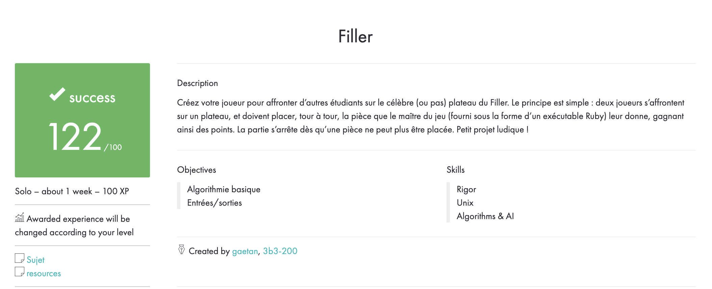

# Filler

5th C project for 42 Paris school.

<b>Summary:</b> We had to create our own programme-player to confront the ones of other student on the school made programme Filler. The principle is as follow: 2 players oppose each other on a board game and must place, one at a time, the piece given by the master of the game (enacted by a Ruby executable). They gain points doing so. The game end when no more pieces can be placed.

